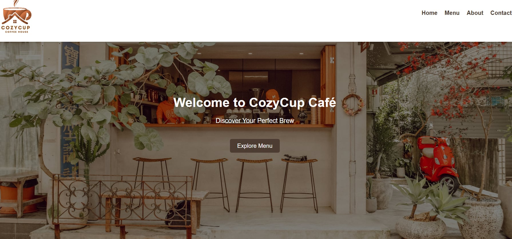
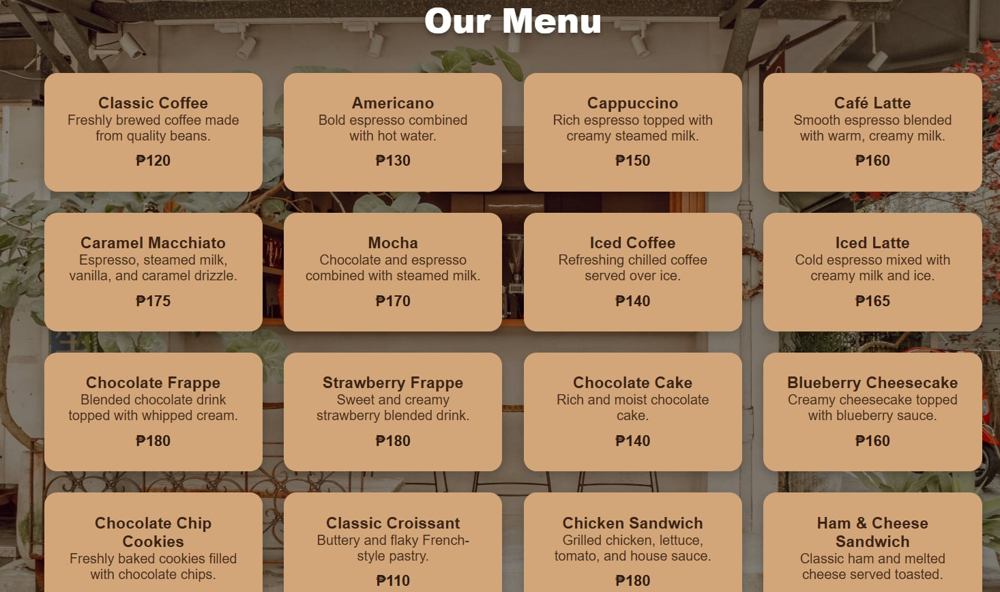
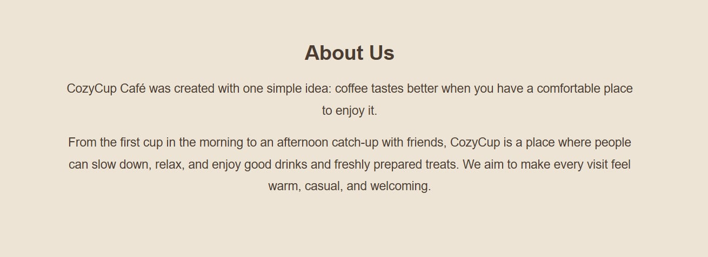
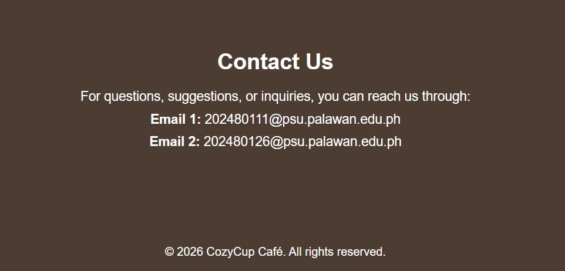

# Cozy-Cup-Cafe

## Project Description

Cozy Cup Cafe is more than just a coffee shop — it's a home away from home. Designed with a warm and relaxing ambiance, it's the perfect place to enjoy great food, freshly brewed coffee, and meaningful conversations with friends and family. Whether you're looking to unwind after a long day or catch up with loved ones, Cozy Cup Cafe offers a cozy, welcoming space where every visit feels comfortable and familiar.g

## Features

## Features

- **Home Page** with a welcoming hero banner and tagline ("Discover Your Perfect Brew")
- **Navigation Menu** for easy access to Home, Menu, About, and Contact sections
- **Menu Page** showcasing a variety of coffee, drinks, pastries, and food items with prices
- **About Us Section** sharing the story and philosophy behind CozyCup Café
- **Contact Us Section** with email addresses for inquiries and support
- **Clean, Responsive Design** with a warm, cozy color palette that reflects the cafe's atmosphere

## Screen Captures

Short description of what this screenshot shows (e.g. the homepage layout with hero banner).

Short description of what this screenshot shows (e.g. the menu page listing drinks and food items).

Short description of what this screenshot shows (e.g. the about page with cafe story).

Short description of what this screenshot shows (e.g. the contact page with map and form).

## About the Authors

<table>
  <tr>
    <td align="center">
       
      <b>Name:</b> Cyrek Samuel Pallorina 
      <b>Email:</b> 202480126@psu.palawan.edu.ph 
      
      
    </td>
    <td align="center">
       
      <b>Name:</b> Seanley Montecillo 
      <b>Email:</b> 202480111@psu.palawan.edu.ph 
      
      
    </td>
  </tr>
</table>